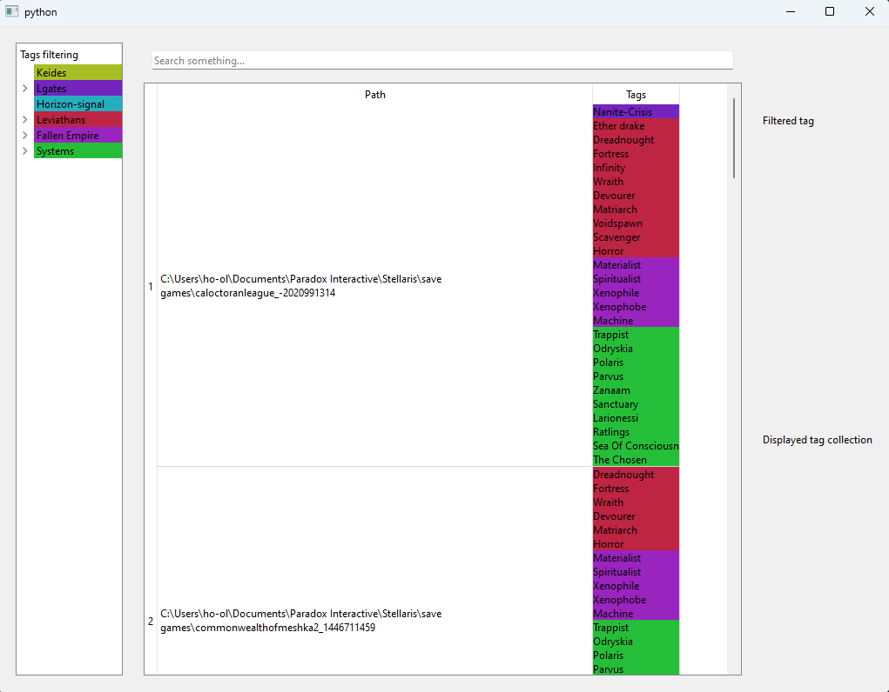
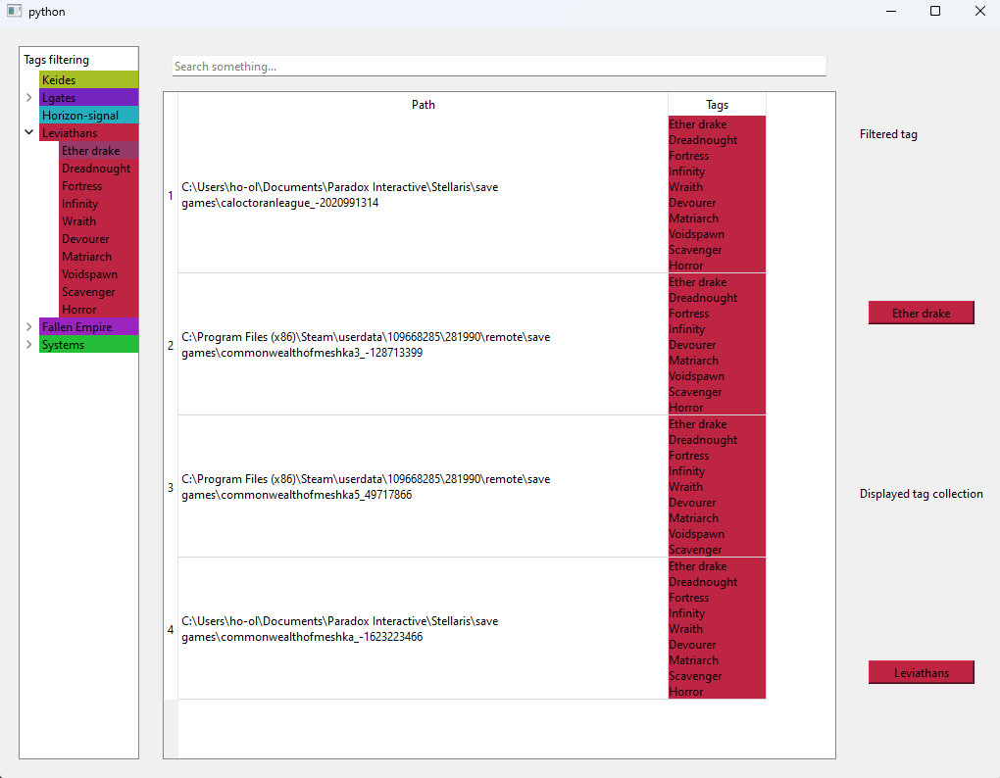

# Stellaris-flag-check
As a purist ironman stellaris player that plays without mods, some of the hardest achievements requires some flag to be raised at Galaxy generation.
Or you may want to play a specific play-style that requires some system to exist.
Or simply you want to enjoy knowing that you may be able to find the Horizon Signal in some of your save.
This app provides way to check for those flags without the annoying part of extracting and searching for those flags yourselves.
In bonus, there is 'nice' front app to let you filter multiple condition at once.
## Features:
- Possible filter on most of the random galaxy init flag
- Combine filters to search only the "ultimate game"
- Customisable font-end using color flags and some "small" tinkering if you feel like it.
- Customisable flag checking if you are using mods or if those flags are not enough for you.
## Usage:
- the simplest way to use this app is to download and run the provided binary
- from source (requires git):
  - ```git clone https://github.com/Game-fan-hoarder/Stellaris-flag-check```
  - ```cd Stellaris-flag-check```
  - ```python -m venv .venv```
  - ```.venv\Scripts\activate``` on windows or ```source venv/bin/activate``` or linux/macOs
  - ```pip install -r requirements.txt```
  - ```python front.py```

## Customization
To customize this script, you will have to edit the flags.yaml
To change color, edit the color.json file.

## Screenshot


